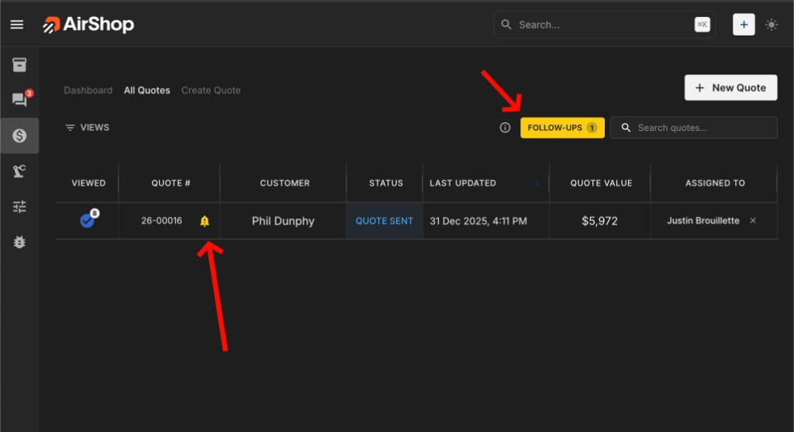
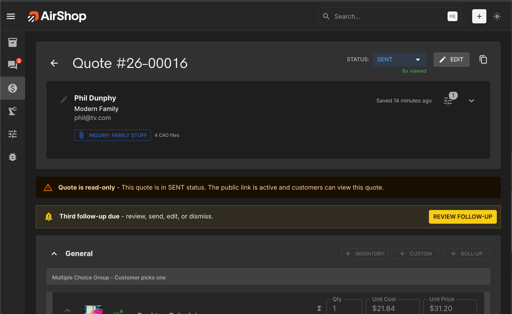
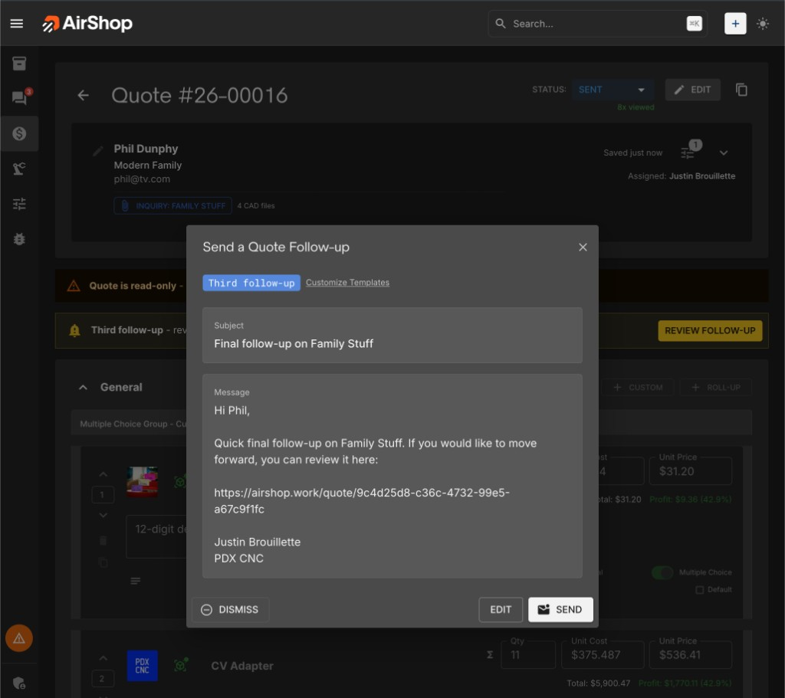

# Quote Follow-ups

Quote follow-ups help you stay on top of sent quotes that need attention. When a follow-up is due, AirShop shows a reminder so you can send a customer-facing email—either as a preview or with edits—directly from the Quotes list (Data Grid) or Quote Builder.

[Open Quotes](https://airshop.work/quotes){ target="_blank" rel="noopener noreferrer" }

---

## Overview

After you send a quote, AirShop [tracks when the customer opened it](quotes/view-tracking.md). Based on your schedule, follow-up reminders appear when:

- **Unopened** — The quote was sent but not viewed within a set number of hours
- **First follow-up** — A set number of days after the quote was sent
- **Second follow-up** — A later milestone (e.g., 7 days)
- **Third follow-up** — A final milestone (e.g., 14 days)

Each reminder is sent **to your customer** from your organization. You choose when to send, and you can edit the subject and body before sending or dismiss the reminder for that step.

---

## Where Follow-ups Appear

| Location | What You See |
|----------|--------------|
| **[Quotes list](https://airshop.work/quotes/all)** | A **FOLLOW-UPS** button shows the count of quotes needing follow-up. Quotes with reminders due display a bell icon. Click the button or open a quote to act. |
| **Quote Builder** | When viewing a sent quote with a follow-up due, a reminder banner and **REVIEW FOLLOW-UP** button appear in the quote view. |

{ .screenshot }

{ .screenshot }

Follow-up visibility and actions depend on your organization's quote access and permissions.

---

## Sending a Follow-up

1. In the [Quotes list (Data Grid)](https://airshop.work/quotes/all){ target="_blank" rel="noopener noreferrer" }, click **FOLLOW-UPS** to see quotes needing attention, or open a quote with a bell icon (or open it directly in Quote Builder).
2. Click **REVIEW FOLLOW-UP** in the quote view. The **Send a Quote Follow-up** dialog opens with the follow-up type (e.g., Third follow-up), subject, and message pre-filled from your template.
3. Use **Customize Templates** to change defaults, or edit the subject and message in the dialog.
4. Choose:
    - **SEND** — Sends the email to the customer.
    - **EDIT** — Make changes to the subject and body, then send.
    - **DISMISS** — Hides this step for this quote. Future follow-up steps can still become due.

{ .screenshot }

The email is sent to the customer’s email address. Replies go to the address configured in [Quote Email Reply-To Settings](quote-settings.md#quote-email-reply-to-settings).

---

## Follow-up Schedule

Configure timing in [Quote Templates](https://airshop.work/settings/quote-templates){ target="_blank" rel="noopener noreferrer" } under **Follow-up Email Templates & Timing**.

| Setting | Default | Description |
|---------|---------|-------------|
| **Enable follow-ups** | On | Turn follow-up reminders on or off for your organization. |
| **Unopened (hrs)** | 12 | Hours after sending before a first follow-up is due if the quote has not been viewed. |
| **First (days)** | 3 | Days after sending when the first follow-up becomes due. |
| **Second (days)** | 7 | Days after sending when the second follow-up becomes due. |
| **Third (days)** | 14 | Days after sending when the third follow-up becomes due. |

**Logic:**

- **First follow-up** is due when either:
  - The quote was sent and not viewed for at least **Unopened (hrs)**, or
  - At least **First (days)** have passed since the quote was sent.
- **Second** and **Third** follow-ups use your configured day milestones. Depending on quote activity, reminders may use sent or viewed timing data.

---

## Follow-up Email Templates

Each follow-up step has its own subject and body template. Configure them in [Quote Templates](https://airshop.work/settings/quote-templates){ target="_blank" rel="noopener noreferrer" } under **Follow-up Email Templates & Timing**.

### Default Templates

| Step | Default Subject | Default Body (summary) |
|------|-----------------|------------------------|
| First | Any Questions on [Quote-title] | Brief check-in, asks if the customer has questions, includes quote link. |
| Second | Following up on [Quote-title] | Checking in on the quote, offers to answer questions. |
| Third | Final follow-up on [Quote-title] | Final reminder with quote link. |

### Template Tokens

Use these placeholders in your subject and body. They are replaced when the email is sent.

| Token | Replaced With |
|-------|---------------|
| `[Quote-title]` or `{quote_title}` | Quote title or quote number |
| `[Customer-given-names]` or `{customer_name}` | Customer’s first name or full name |
| `[Your-name]` or `{sender_name}` | Sender’s name |
| `[company-name]` or `{company_name}` | Organization name |
| `[quote-link]` or `{quote_link}` | Link to the quote |
| `{quote_number}` | Quote number |
| `{days_since_sent}` | Days since the quote was sent |
| `{days_since_viewed}` | Days since the customer viewed the quote |

---

## Requirements & Exclusions

- **Quote status** — The quote must be in **SENT** status.
- **Customer email** — The customer must have an email address.
- **Sample quotes** — Follow-ups are not available for sample quotes.
- **Access and permissions** — Visibility and actions depend on your organization's quote access rules.

---

## Related

- [Quote View Tracking](quotes/view-tracking.md) — When customers open your quotes
- [Quote Settings](quote-settings.md) — Reply-to, display, and organization defaults. [Open Quote Settings](https://airshop.work/settings/quote-settings){ target="_blank" rel="noopener noreferrer" }
- [Quote Templates](https://airshop.work/settings/quote-templates){ target="_blank" rel="noopener noreferrer" } — Follow-up templates and timing
- [Quote Options Panel](quotes/quote-options-panel.md) — Per-quote overrides
- [Create a Quote](quotes/create-quote.md) — [Create Quote](https://airshop.work/quotes/create-quote){ target="_blank" rel="noopener noreferrer" }
