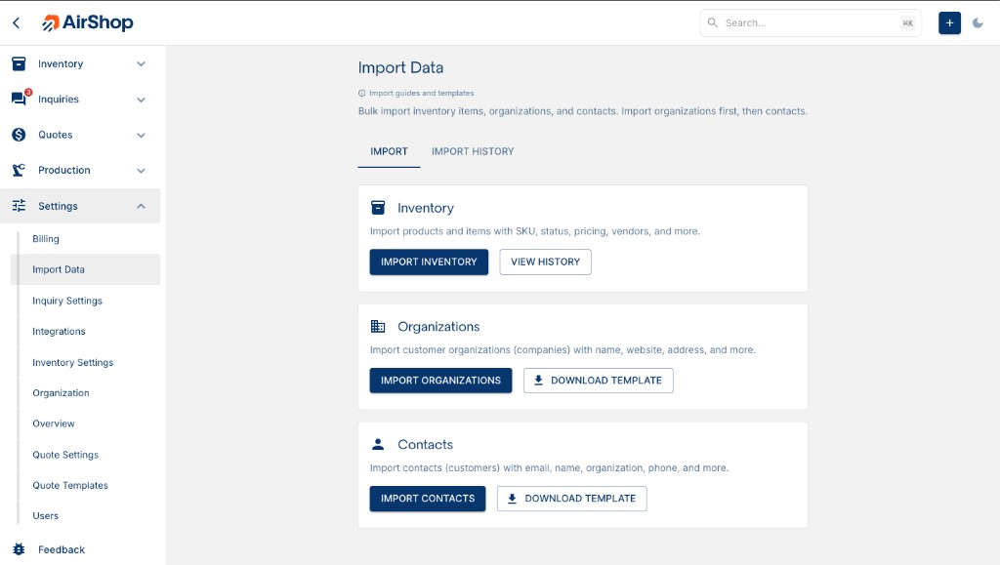

# Bulk Imports

Bulk import lets you add or update many records at once by uploading CSV or Excel files. All imports are available from **Settings → Import Data** at [airshop.work/import](https://airshop.work/import).

[Open Imports page](https://airshop.work/import){ target="_blank" rel="noopener noreferrer" }

{ .screenshot }

---

## Recommended Import Order

When importing data for the first time, follow this order so records link correctly:

1. **Organizations** — Import customer organizations (companies) first
2. **Customers** — Import people and link them to organizations by name
3. **Inventory** — Import products, SKUs, and stock levels

---

## Import Types

### Organizations

Import customer organizations (companies you do business with) with name, website, address, and more.

- **Template:** `airshop-organizations-import-template.csv`
- **Required:** Organization Name
- **Access:** [Import Data](https://airshop.work/import) → Import Organizations, or [Organizations](https://airshop.work/organizations) → Import

See [Bulk Import Organizations](bulk-import-organizations.md) for fields and format.

For QuickBooks users, see [QuickBooks Import](quickbooks-import.md) for export steps and column mapping.

---

### Customers

Import customers (people) and link them to existing organizations by name.

- **Template:** `airshop-customers-import-template.csv`
- **Required:** Email, First Name, Last Name
- **Access:** [Import Data](https://airshop.work/import) → Import Customers, or [Customers](https://airshop.work/customers) → Import

See [Bulk Import Customers](bulk-import-customers.md) for fields and format.

---

### Inventory

Import inventory items (products, parts) with SKU, status, pricing, and vendor info.

- **Template:** `airshop-inventory-import-template.csv`
- **Required:** name, status
- **Access:** [Import Data](https://airshop.work/import) → Import Inventory, or [Inventory](https://airshop.work/inventory) → ITEM dropdown → Import

See [Bulk Import Inventory](../inventory/bulk-import.md) for fields and format.

---

## Exports

Inventory exports use the `airshop-` prefix for easy identification:

- **Inventory export:** `airshop-inventory-export-YYYY-MM-DD.csv` (all, selected, or filtered)
- **Stocktake:** `airshop-stocktake-{name}-{date}.csv`

See [Inventory Export](../inventory/inventory-export.md) for details.

---

## Administrator Only

All bulk imports and exports are restricted to **Organization Administrators**. See [Settings](https://airshop.work/settings) for organization management.
