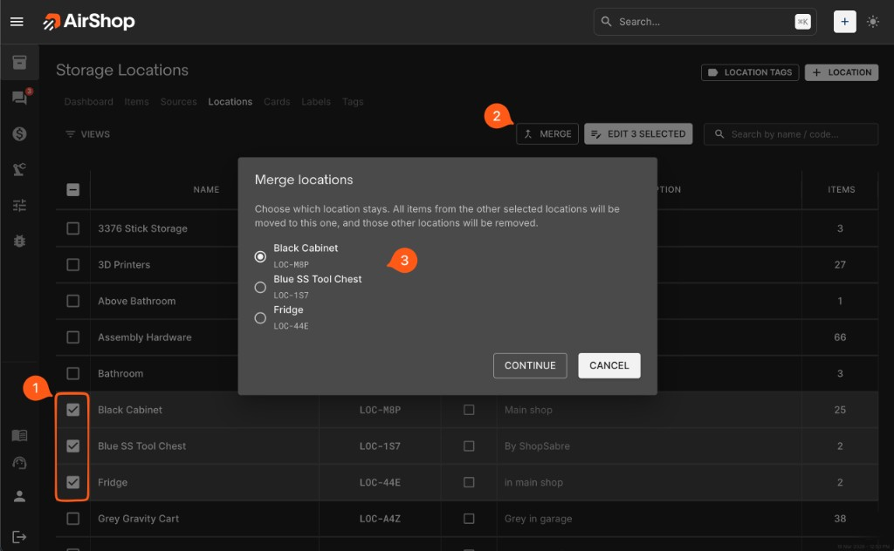
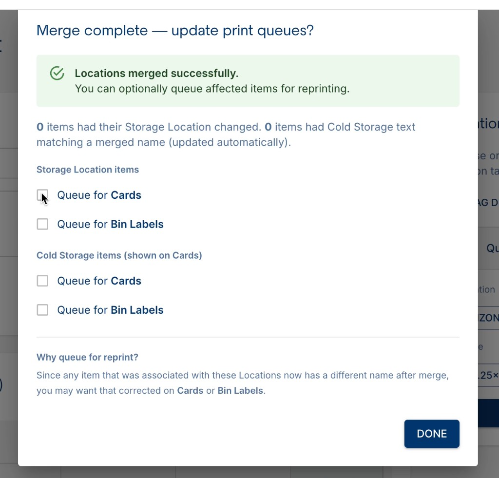

# Merging Locations

When several Locations really mean the same spot, or you are tidying up your layout, you can **merge** them into one. AirShop moves every item from the Locations you are done with into the Location you keep, then removes those extra Locations.

## Two ways to merge

### Merge several Locations

1. Go to [**Inventory**](https://airshop.work/inventory) → [**Locations**](https://airshop.work/inventory/locations).
2. Turn on the **checkboxes on the left** for **two or more** Locations you want to combine.
3. When more than one row is selected, **MERGE** appears along with the other actions for your selection. Click **MERGE**.

Use this method when you want to fold **more than two** Locations into one in a single step.

### Merge Two Locations

1. Open a Location so you see its full page—not just the list.
2. Tap or click the **⋮** (three-dot) menu on that page.
3. Choose the merge option, then pick **one** other Location to combine with the one you have open.

Use this method when you only need to merge **two** Locations: the one you are looking at, and one other.

---

## Pick the Location that survives

A **Merge locations** window opens. Choose **one Location that keeps its name and ID**. Everything stored in the **other** Locations moves there, and those other Locations go away.

The picture below shows what you see after selecting several Locations on the list and clicking **MERGE**.

{ .screenshot }

1. Click the Location that should remain (the round radio buttons).
2. Click **CONTINUE** to go ahead, or **CANCEL** to stop without changing anything.

The text in the window reminds you that all items move into the Location you keep, and the rest are removed.

---

## After you merge

When the merge finishes, AirShop opens **Merge complete — update print queues?**

{ .screenshot }

AirShop confirms **Locations merged successfully** and shows counts of items whose **Storage Location** or **Cold Storage** text changed.

1. Under **Storage Location items**, check **Queue for Cards** and/or **Queue for Bin Labels** for items you want reprinted.
2. Under **Cold Storage items (shown on Cards)**, do the same if those need reprinting.
3. Click **DONE**. Leave the boxes unchecked if you do not need reprints right now.

---

## Related

- [Managing Locations](locations.md) — creating, editing, and organizing Locations
- [Cards & Bin Labels](cards-and-labels.md) — printing Cards and Bin Labels
- [Location Tags](location-tags.md) — printing Labels for a Location
