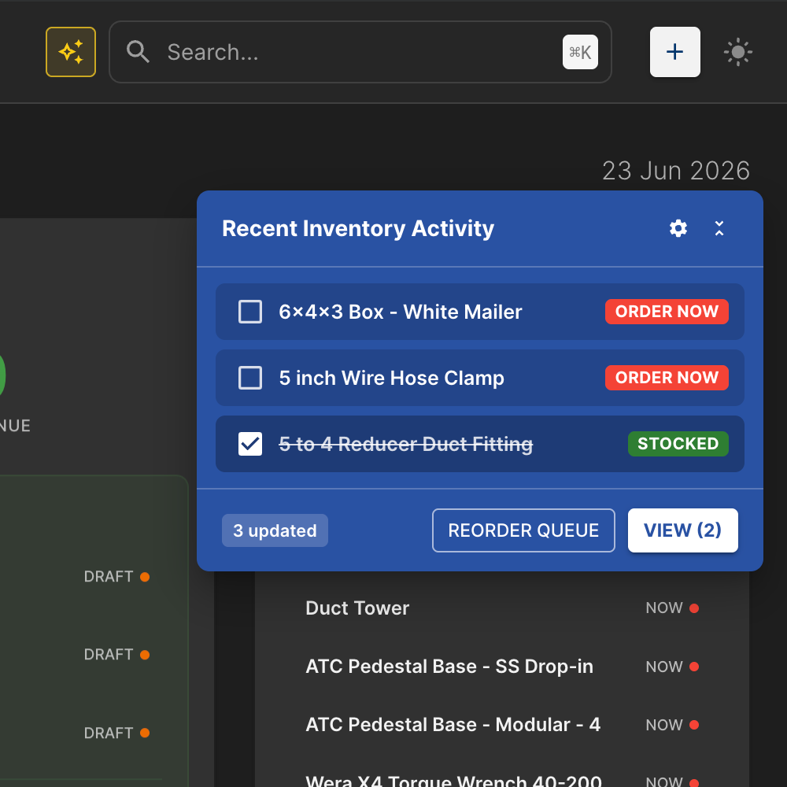
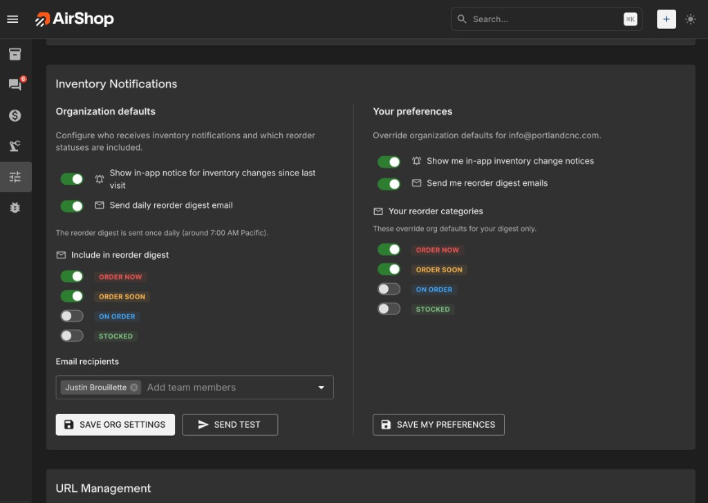

# Reorder Queue & Notifications

The Reorder Queue helps your team stay ahead of stockouts. It surfaces every item that needs attention based on its **reorder status**, and AirShop can keep the right people informed two ways: an **in-app change notice** and a **daily reorder digest email**.

**How to Find:**

- Go to [**Inventory**](https://airshop.work/inventory) → **Items**, then open the **Reorder Queue** view
- OR open it directly: [Open Reorder Queue](https://airshop.work/inventory/items?view=Reorder%20Queue){ target="_blank" rel="noopener noreferrer" }

---

## Reorder statuses

Every inventory item carries a reorder status. These statuses drive the queue, the in-app notices, and the digest email:

| Status | Meaning |
|--------|---------|
| **Order Now** | Out of stock or at/below threshold — order immediately. |
| **Order Soon** | Running low — plan to reorder shortly. |
| **On Order** | A purchase order has already been placed. |
| **Stocked** | Healthy stock level — no action needed. |

Items in **Order Now**, **Order Soon**, and **On Order** make up the working Reorder Queue. **Stocked** items are available for notifications but are off by default.

---

## The Reorder Queue view

The Reorder Queue is a saved view on the [Inventory Items](https://airshop.work/inventory/items){ target="_blank" rel="noopener noreferrer" } grid that filters to items needing attention. From here you can:

- See item name, code, current **quantity**, and **low stock threshold** at a glance
- Sort and filter to focus on the most urgent items
- Open an item to update its status (for example, move it to **On Order** after placing a PO)

Newly added items that need attention are highlighted so they are easy to spot.

---

## In-app change notice

When inventory changes since your last visit, AirShop shows a notice summarizing what your team did — items added, updated, merged, or imported — with anything needing reorder attention surfaced first.

{ .screenshot }

- On your **first visit**, only recent activity (the last 24 hours) is shown, not your full history.
- The notice highlights items that moved into **Order Now** or **Order Soon**.
- You can review and dismiss the notice; it tracks what you have already seen.

Admins enable this org-wide under **Organization defaults**; each user can turn it off for their own account under **Your preferences**.

### Snooze the notice

If now is not the right time to act on inventory changes, you can snooze the notice instead of dismissing it. Click the **snooze** icon in the notice header to choose how long to hide it:

- **For 3 hours** — snoozes until three hours from now.
- **Until 4:00 PM** — snoozes until 4:00 PM today. This option only appears before 4:00 PM; after that it is hidden because it would have no effect.
- **Until tomorrow 8:00 AM** — snoozes until 8:00 AM the next day.

While the notice is snoozed:

- A small **snooze indicator** appears in the left navigation. When the nav is expanded it shows a compact card — "Recent Inventory Activity", "Back at *time*", and a **SHOW *N*** button. When the nav is collapsed it shrinks to a single snooze icon; hovering shows how many updates are waiting and when the notice returns.
- Click the indicator (or **SHOW *N***) at any time to bring the notice back immediately, before the snooze expires.
- When the snooze period ends, the notice reappears on its own.

A few details worth knowing:

- **Snooze is per person.** Snoozing only affects your own view; it never hides the notice for teammates.
- **It sticks across reloads.** Your snooze is remembered in your browser, so refreshing the page or navigating around AirShop will not clear it. Using a different browser or device starts fresh.
- **It only hides the in-app notice.** Snoozing does not change the daily reorder digest email or anything in the Reorder Queue itself — items still need attention; you have just chosen to be reminded later.
- The indicator only shows while there are still updates to review. If you handle everything (so nothing is pending), there is nothing left to surface when the snooze ends.

> **Tip:** Prefer to keep the notice on screen but out of the way? Use **minimize** (the collapse control in the notice header) instead of snooze — it shrinks the notice to a small badge with the pending count without hiding it.

---

## Daily reorder digest email

When the digest is enabled, AirShop emails a daily summary of items that need attention to the chosen recipients — once per day (around **7:00 AM Pacific**).

The email groups items by status (**Order Now**, **Order Soon**, **On Order**, **Stocked**), shows quantity and threshold for each, flags newly added items, and links straight to the [Reorder Queue](https://airshop.work/inventory/items?view=Reorder%20Queue){ target="_blank" rel="noopener noreferrer" }. Each item links to its detail page where an item code is available.

You only receive the email on days when there is something to report — if nothing needs attention, no email is sent. AirShop also prevents duplicate sends, so the same digest will not arrive twice in one day.

---

## Configuring notifications

Open [**Settings → Inventory Settings**](https://airshop.work/settings/inventory-settings){ target="_blank" rel="noopener noreferrer" } and find the **Inventory Notifications** card. There are two sides:

{ .screenshot }

### Organization defaults (admins)

Admins set the defaults for the whole organization:

- **Show in-app notice for inventory changes** — toggle the in-app change notice.
- **Send daily reorder digest email** — toggle the digest email.
- **Include in reorder digest** — choose which statuses are included (**Order Now** and **Order Soon** are on by default).
- **Email recipients** — pick the team members who receive the digest. If no one is selected, AirShop falls back to organization admins and owners.
- **Send test** — send yourself a sample digest to preview exactly what recipients will get.

Click **Save org settings** to apply.

### Your preferences (every user)

Each user can override the org defaults for their own account:

- **Show me in-app inventory change notices** — opt in or out of the in-app notice.
- **Send me reorder digest emails** — opt in or out of the digest email.
- **Your reorder categories** — override which statuses appear in *your* digest only.

Click **Save my preferences** to apply.

---

## How an item qualifies

For each recipient, AirShop builds the digest from active inventory items whose status is in the enabled categories (org defaults, adjusted by the recipient's personal overrides). For each item it reads the current **quantity** and **low stock threshold**, and flags items created in the last 24 hours as **new**.

If a recipient has no items in their enabled categories on a given day, they are skipped for that day.

---

**Related:** [Inventory overview](index.md) · [Sources](sources.md) · [Inventory Export](inventory-export.md) · [Glossary](../glossary.md)
