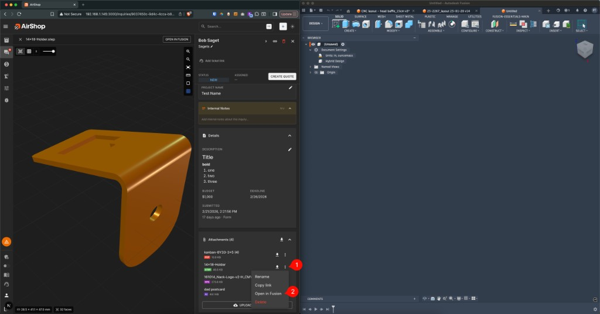
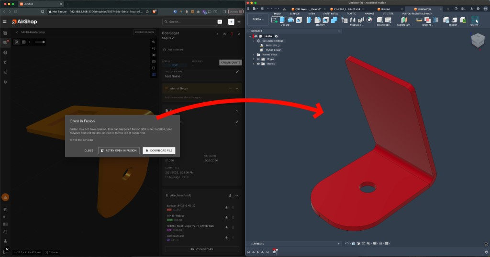

# Open in Fusion

You can open 3D model files from inquiry attachments directly in **Autodesk Fusion**. This lets you work on CAD files without downloading them first.

[Open Inquiries](https://airshop.work/inquiries){ target="_blank" rel="noopener noreferrer" }

---

## How to Open in Fusion

There are two ways to open a file in Fusion from an inquiry:

### Method 1: From the 3D Viewer

When a compatible 3D model is displayed in AirShop's integrated 3D viewer:

1. Open the inquiry and view the 3D model in the viewer.
2. Click **OPEN IN FUSION** in the viewer header.

{ .screenshot }

### Method 2: From the Attachments List

1. Open the inquiry.
2. In the **Attachments** section, find the 3D model file you want.
3. Click the **⋯** (more options) icon next to the file.
4. Select **Open in Fusion** from the menu.

---

## Supported File Types

| Format | Supported |
|--------|-----------|
| **Fusion** (`.f3d`) | Yes — native format |
| **STEP** (`.step`, `.stp`) | Yes — confirmed working |
| **IGES** (`.iges`, `.igs`) | Yes |
| **SAT** (`.sat`) | Yes |
| **STL** (`.stl`) | Yes |
| **OBJ** (`.obj`) | Yes |

The **Open in Fusion** option appears only for file types that Fusion can open via the `fusion360://` protocol. Non-CAD files (e.g., images, PDFs) do not show this option.

---

## Requirements

- **Autodesk Fusion** must be installed on your computer.
- Your browser must allow the link to launch Fusion (some browsers block external app links).
- The file format must be supported by Fusion.

---

## If Fusion Doesn't Open

If Fusion does not open when you click **Open in Fusion**, AirShop shows a dialog with options:

- **Fusion may not have opened** — This can happen if Fusion is not installed, your browser blocked the link, or the file format is not supported.
- **RETRY OPEN IN FUSION** — Try again.
- **DOWNLOAD FILE** — Download the file and open it manually in Fusion.

{ .screenshot }

---

## Related

- [Inquiry Forms](setup/inquiry-forms.md) — How inquiries and attachments are collected
- [Create a Quote](quotes/create-quote.md) — Turn inquiries into quotes
