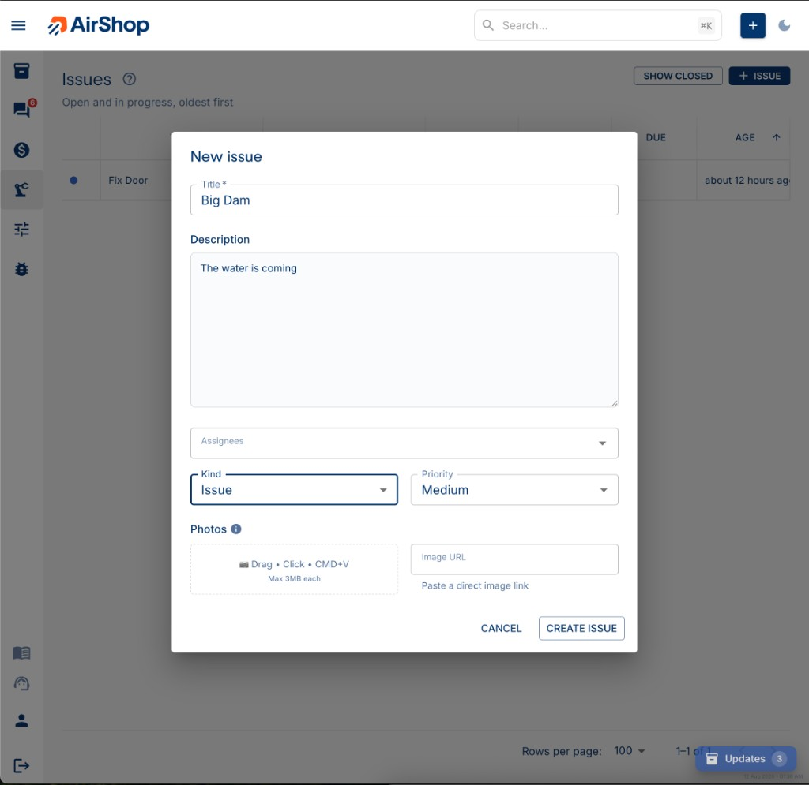
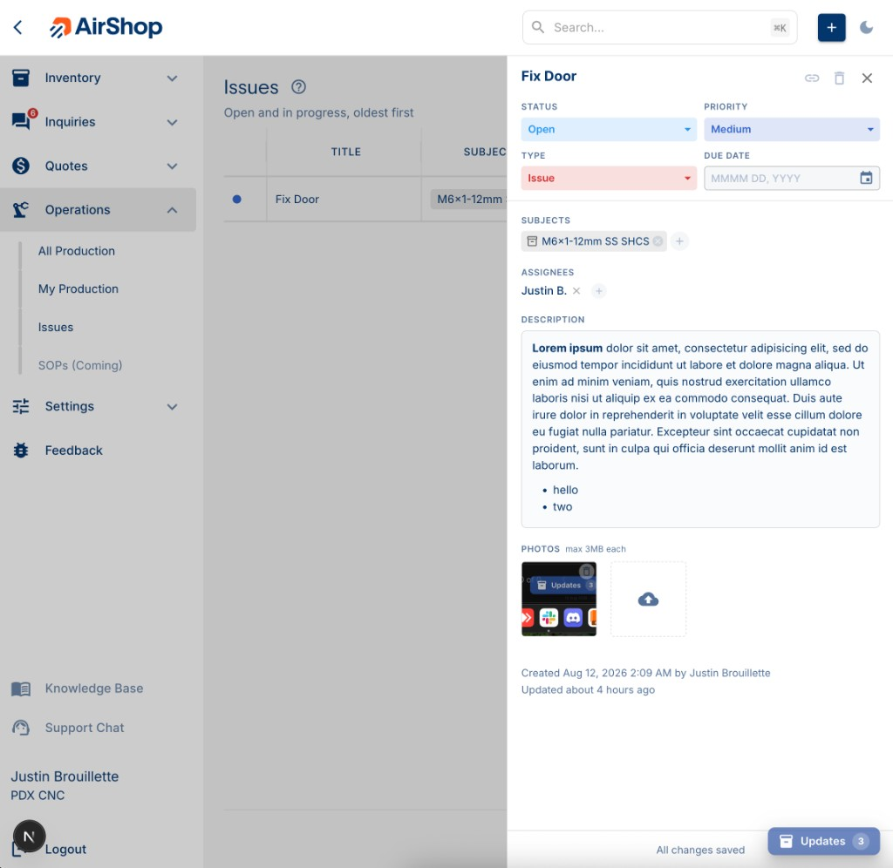
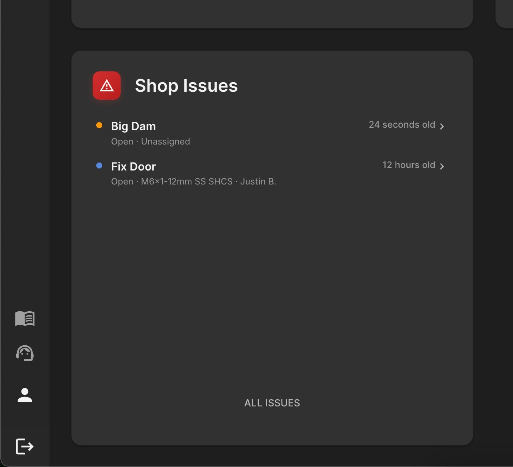

# Issues

**Issues** are your shop's problem log for broken equipment, needed repairs, feature requests, and improvements. They're separate from reporting an AirShop app bug. Issues live inside your shop, get assigned to your team, and get tracked to resolution.

## Overview

Report an issue in seconds, assign it to a teammate, and track it through to done from the same dashboard where you manage inventory and quotes.

**How to Find:**

- Go to [**Operations**](https://airshop.work/issues) → **Issues**
- The **Shop Issues** card on your Home dashboard
- Search for an issue by title from the search bar at the top of the app
- On an inventory item's detail page, under **Open issues**
- Direct link: `/issues` (list) or `/issues/{id}` (a specific issue)

---

## Creating an Issue

1. Open [**Issues**](https://airshop.work/issues){ target="_blank" rel="noopener noreferrer" } (from the Home dashboard or an inventory item's **Report issue** button).
2. Click **ISSUE** to open the **New issue** form.
3. Fill in:
    - **Title** (required) — what's broken or needs to change.
    - **Description** — add detail, formatting, and photos.
    - **Assignees** — who's responsible for it (optional, multiple people allowed).
    - **Kind** — Issue, Feature Request, Improvement, or Other.
    - **Priority** — Low, Medium, High, or Critical.
    - **Photos** — drag a file in, click to browse, paste an image (**Cmd/Ctrl+V**), or paste an image URL.
4. Click **Create issue**.

{ .screenshot }

Every new issue starts with status **Open**. Due dates are set afterward, from the issue itself.

---

## The Issues List

The list shows **Title**, **Subjects** (linked inventory items, assets, or SOPs), **Assignees**, **Status**, **Due** date, and **Age**, sorted oldest-first by default so nothing sits ignored.

By default you only see **Open** and **In Progress** issues. Toggle **SHOW CLOSED** (or **ALL STATUSES**) to also see **Resolved** and **Done** work. Use the grid's **Columns** and **Filters** tools to customize the view further.

Click any row to open the issue in a side drawer. The page URL updates to `/issues/{id}` so you can share, bookmark, or reload directly into that issue.

---

## Working an Issue (the Drawer)

Opening an issue shows a drawer with everything you need:

- **Title** — click to rename.
- **Status**, **Priority**, **Type**, and **Due date** — update and click **Save**.
- **Subjects** — link the issue to an inventory item, asset, or SOP/process.
- **Assignees** — add or remove who's responsible.
- **Description** — a rich-text editor for notes, steps, and details.
- **Photos** — add more, or open any existing photo full-size.
- **Copy link to issue** — puts the shareable `/issues/{id}` URL on your clipboard.
- **Delete issue** — permanently removes it.

{ .screenshot }

Changes you make are highlighted with **Reset** / **Save** buttons until you save them. The drawer warns you before discarding unsaved changes.

---

## Status Workflow

Issues move through four stages:

**Open** → **In Progress** → **Resolved** → **Done**

- Move an issue to any status at any time. There's no required order.
- Reopening a resolved or done issue clears its resolution/completion history so the next pass starts clean.
- "Closed" issues (in filters and messaging) means **Resolved** or **Done**.

---

## Priority and Type

| Priority | Meaning |
|----------|---------|
| Low | Nice to fix, no urgency |
| Medium | Normal shop work (default) |
| High | Should be addressed soon |
| Critical | Blocking or urgent |

| Type | Meaning |
|------|---------|
| Issue | Something's broken or wrong (default) |
| Feature Request | A new capability someone wants |
| Improvement | Something works, but could be better |
| Other | Anything else |

---

## Due Dates

Set an optional due date from the issue drawer once it's created. The list and Home dashboard show it as:

- **Today** or **Tomorrow**
- **N days late** if it's overdue
- A short date if it's further out

Issues due soon (within 3 days) or already overdue are called out visually so they don't get missed.

---

## Linking Issues to Inventory, Assets, or SOPs

Issues can be linked to a **Subject**. Right now that's an inventory item or a SOP/process (asset linking is coming). Use the **Subjects** field in the drawer to search and attach one, or report the issue directly from an inventory item's detail page, which links it automatically.

---

## Photos

Add photos when creating an issue or any time afterward from the drawer:

- Drag and drop, click to browse, paste with **Cmd/Ctrl+V**, or paste an image URL.
- On mobile, the drawer supports capturing a photo directly from your camera.
- Each photo must be under 3MB.
- Click any photo to view it full-size; deleting asks for confirmation first.

---

## Shop Issues on Your Dashboard

The **Shop Issues** card on Home shows your open and in-progress work, sorted so overdue items surface first, then by priority, then by soonest due date. It calls out how many issues are overdue and links straight to the full list. If there's nothing open, it shows **All clear**.

{ .screenshot }

---

## Finding Issues in Search

Use the app's search bar to find an issue by title, description, linked subject, status, or type. Search checks every issue (including closed ones), while the Home dashboard card only shows open work.

---

## Summary

| Want to... | Do this |
|------------|---------|
| Report something broken | Click **ISSUE** on the Issues page, or **Report issue** from an inventory item |
| See what's outstanding | Check the **Shop Issues** card on Home |
| Assign work | Open the issue drawer → **Assignees** |
| Track a deadline | Open the issue drawer → **Due date** |
| Mark something done | Move status to **Resolved**, then **Done** |
| Share an issue | Open it, click **Copy link to issue** |
