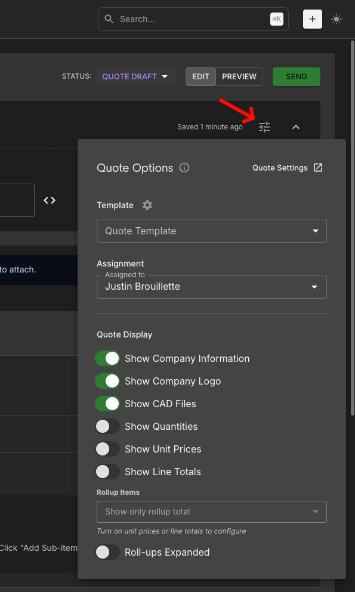

# Quote Settings

**How to Find:**

- In **Left Nav**, expand **Settings** → **Quote Settings**
- OR **Search** `⌘K` (Mac) / `Ctrl+K` (Windows) for **Quote Settings**

[Open Quote Settings](https://airshop.work/settings){ target="_blank" rel="noopener noreferrer" }

---
AirShop lets you customize your quotes to match your brand and workflow. Add your logo, control what appears on each quote, and set default margin and tax. Organization-level defaults apply to new quotes unless you override them per quote using the **Quote Options** panel.

{ .screenshot }

---

## Company Information

This is displayed publicly on quotes sent to customers.

- **Company Name** — Your business name
- **Phone** — Contact number
- **Website** — Your company URL
- **Address** — Multi-line address (e.g., PO Box, city, state, ZIP)
- **Company Logo** — Upload your logo; turn on **Show Company Logo** in Quote Options for each quote to display it. Confirm the logo appears in quote preview and PDF export.

---

## Financial Settings

Organization-level defaults for currency, tax, and margin.

- **Currency** — Choose your currency (e.g., US Dollar)
- **Default Tax Rate** — Set default tax percentage
- **Minimum Profit Target** — Minimum margin percentage
- **Profit Target** — Default profit target percentage
- **Default Additional Margin** — Extra margin applied to new quotes
- **Enable Tax Calculations** — Toggle tax on or off
- **Enable Margin Calculations** — Toggle margin calculations on or off

---

## Template Settings

Control how quote titles and dates appear.

- **Project Title Template** — Use `{quote_number}` for dynamic values
- **Default Expiration Days** — Number of days until a quote expires (e.g., 30)
- **Date Format** — Choose display format (e.g., DD MMM YYYY)

---

## Quote Number Format

Configure how quote numbers are generated.

- **Quote Number Format** — Use `{{#####}}` for auto-incrementing numbers and `{{quoteVersionNumber}}` for version. Example: `yy-{{#####}}-{{quoteVersionNumber}}`
- **Next Quote Number** — Leave blank to auto-increment from the current highest, or set a starting value

---

## Payment Options

!!! info "Coming Q1 2026"
    Payment options will be available in Quotes in Q1 – 2026.

---

## Quote Options panel

Each quote has a **Settings** button in the upper right that opens the Quote Options panel. Use it to override organization settings for that quote only—for example, when a specific quote needs different display options or styling.

{ .screenshot }

**How to access:** In the Quote Builder, click the settings icon (stack of horizontal lines) in the upper right—to the right of "Saved X ago" and left of the chevron.

**What the panel shows:**

- **Quote Settings** link (top right of panel) — Opens the full Quote Settings page where margin, tax, and organization defaults live
- **Template** — Choose a Quote Template
- **Assignment** — Assigned to
- **Quote Display** toggles — Show Company Information, Show Company Logo, Show CAD Files, Show Quantities, Show Unit Prices, Show Line Totals
- **Rollup Items** — Show only rollup total, Roll-ups Expanded (requires unit prices or line totals enabled)

---

## Quote Display

Control what appears on each quote using the toggles in the Quote Options panel:

- Toggle **Show Company Information** on or off
- Toggle **Show Company Logo** on or off
- Toggle **Show CAD Files**, **Show Quantities**, **Show Unit Prices**, **Show Line Totals** as needed
- Configure **Rollup Items** (requires unit prices or line totals enabled)
