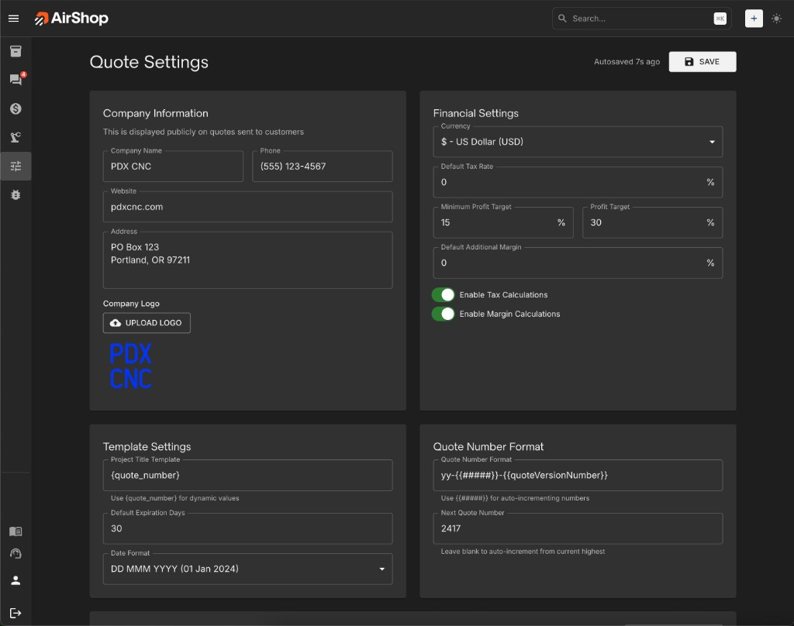

# Quote Settings

**How to Find:**

- In **Left Nav**, expand **Settings** → **Quote Settings**
- OR **Search** `⌘K` (Mac) / `Ctrl+K` (Windows) for **Quote Settings**

[Open Quote Settings](https://airshop.work/settings){ target="_blank" rel="noopener noreferrer" }

---
AirShop lets you customize your quotes to match your brand and workflow. Add your logo, control what appears on each quote, and set default margin and tax. Organization-level defaults apply to new quotes unless you override them per quote using the [Quote Options panel](quotes/quote-options-panel.md).

{ .screenshot }

---

## Company Information

This is displayed publicly on quotes sent to customers.

- **Company Name** — Your business name
- **Phone** — Contact number
- **Website** — Your company URL
- **Address** — Multi-line address (e.g., PO Box, city, state, ZIP)
- **Company Logo** — Upload your logo; turn on **Show Company Logo** in [Quote Options](quotes/quote-options-panel.md) for each quote to display it. Confirm the logo appears in quote preview and PDF export.

---

## Financial Settings

Organization-level defaults for currency, tax, and margin.

- **Currency** — Choose your currency (e.g., US Dollar)
- **Default Tax Rate** — Set default tax percentage
- **Minimum Profit Target** — Minimum margin percentage
- **Profit Target** — Default profit target percentage
- **Default Additional Margin** — Extra margin applied to new quotes
- **Enable Tax Calculations** — Toggle tax on or off
- **Enable Margin Calculations** — Toggle margin calculations on or off

---

## Template Settings

Control how quote titles and dates appear.

- **Project Title Template** — Use `{quote_number}` for dynamic values
- **Default Expiration Days** — Number of days until a quote expires (e.g., 30)
- **Date Format** — Choose display format (e.g., DD MMM YYYY)

---

## Quote Number Format

Configure how quote numbers are generated.

- **Quote Number Format** — Use `{{#####}}` for auto-incrementing numbers and `{{quoteVersionNumber}}` for version. Example: `yy-{{#####}}-{{quoteVersionNumber}}`
- **Next Quote Number** — Leave blank to auto-increment from the current highest, or set a starting value

---

## Display & Visibility Options

Configure default display settings for new quotes and overall quote visibility. Use **Reset to Defaults** to restore Content & Branding, Pricing & Totals Display, and System Options to their defaults.

**Content & Branding** — Show Company Logo, Show Company Information, Show QR Code, Show CAD Files to Customers

**Pricing & Totals Display** — Show Quantities, Show Unit Prices, Show Line Totals. **Rollup Items** — Show only rollup total, or show each sub-item's price (requires unit prices or line totals enabled)

**System Options** — Auto-Save Enabled

---

## Colors & Branding

Customize the visual appearance of your quotes.

- **Brand Color** — Primary accent color
- **Text Color** — Main text color
- **Background** — Quote background color
- **Highlights** — Highlight/alternate row color
- **Font Family** — Helvetica, Arial, Times, or Georgia

Use the Preview panel to see changes before saving.

---

## Payment Options

!!! info "Coming Q1 2026"
    Payment options will be available in Quotes in Q1 – 2026.

---

## Quote Email Reply-To Settings

Configure where replies to quote emails are sent.

- **Reply-To Email** — Choose **Organization Email**, **Person Sending Quote**, or **Assigned User**
- **Organization Reply Email** — When using Organization Email, enter the address (e.g., quotes@yourcompany.com) where customers should reply

---

## Labor Categories

Define the labor types available when adding labor line items to quotes. These categories appear in the Labor Category dropdown when you add a labor item in the Quote Builder.

- **Add Labor Category** — Click to add a new category
- **Labor Category 1, 2, 3…** — Enter a name for each category (e.g., CNC Labor, Shop Labor, Design Labor, Installation)
- **Remove** — Remove a category you no longer need

Default categories are CNC Labor, Shop Labor, and Design Labor. Add or edit categories to match how your shop tracks labor on quotes.

---

**Related:** To override these settings for a single quote, use the [Quote Options panel](quotes/quote-options-panel.md) in the Quote Builder.
