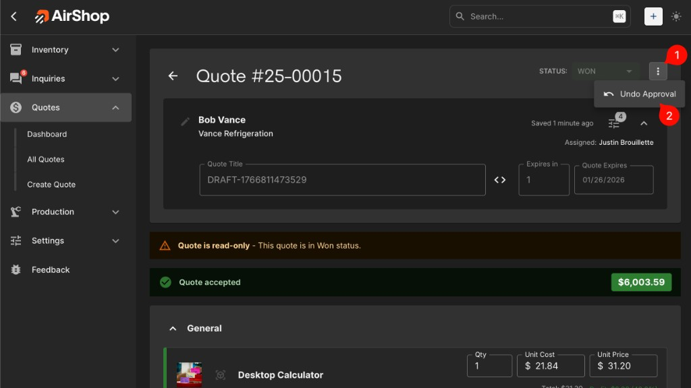

# Undo Quote Approval

If a mistake was made by you or your customer after a quote has been accepted, you can use the **Undo Approval** feature to return the quote to an editable state instead of creating a new one from scratch.

---

## How to Undo Approval

1. Open the quote that is currently in **Won** status.
2. Click the **three-dot menu** (⋮) in the top-right corner of the quote builder.
3. Select **Undo Approval**.
4. Confirm the action in the pop-up dialog.

---

## What Happens Next?

When you undo an approval, the following changes occur:

- **Status Change:** The quote status reverts to **Draft** or **Editing**.
- **Customer Choices Removed:** Any selections or choices made by the customer during the approval process are cleared.
- **Read-Only Lifted:** The quote becomes editable again, allowing you to make necessary corrections.

---

## Finalizing the Quote

After making your changes, you must treat the quote as a new revision:

1. **Update Details:** Fix any errors or update line items as needed.
2. **Resend for Approval:** You must set the quote to **Send** or share the link again to get fresh customer approval. 

Using **Undo Approval** is the recommended way to handle corrections on accepted quotes, ensuring you maintain a single source of truth for your project.

---

## Related

- [Quote Statuses](quote-statuses.md)
- [Quote Revisions](quote-revisions.md)
- [Send and Share Quotes](send-and-share-quotes.md)
