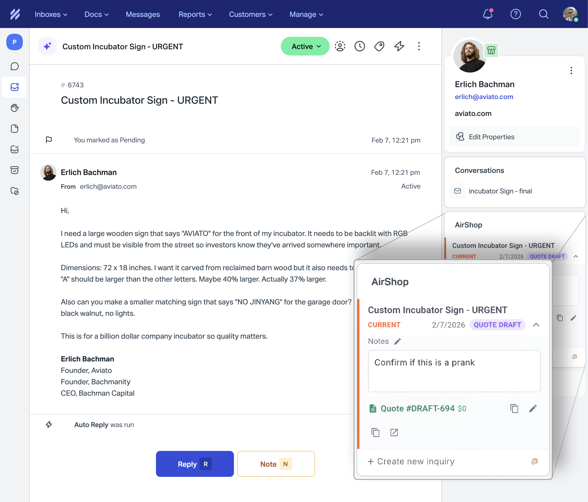

# Help Scout Integration

When you connect Help Scout to AirShop, the AirShop app appears in the sidebar of your Help Scout conversations.

## What the Integration Does

Your team can:

- **View inquiries and quotes** for the customer in the current conversation
- **Create new inquiries** in AirShop without leaving Help Scout
- **Edit notes and status** on inquiries directly from the sidebar
- **Open inquiries in AirShop** with one click

## Prerequisites

- An active AirShop account
- A Help Scout account with admin access

## Setup

### 1) Open the Help Scout settings in AirShop

1. Log in to your AirShop account and go to [Settings → Integrations → Help Scout](https://www.airshop.work/settings/integrations/helpscout)
2. Keep this page open — you'll enter your Mailbox ID and other values here after setting up Help Scout

### 2) Create a Custom App in Help Scout

1. In Help Scout, go to **Manage** → **Apps** → **Custom Apps**
2. Click **Create Custom App**
3. Fill in:
   - **App name:** e.g. "AirShop"
   - **Content URL:** `https://www.airshop.work/helpscout` (no trailing slash)
   - **Content signature key:** Generate a random string (40 characters or less) and save it — you'll need to provide this to AirShop (see 4)
   - **Side Panel URLs:** Same as Content URL, or leave as instructed
4. Click **Save**
5. **Install the app** and assign it to the mailboxes you use for AirShop

### 3) Enter your Mailbox ID in AirShop

1. In Help Scout, go to **Manage** → **Mailboxes** → select the inbox you use for AirShop
2. The **Mailbox ID** is the number at the end of the URL (e.g. `https://secure.helpscout.net/settings/inboxes/12345` → Mailbox ID is `12345`)
3. In AirShop at [Settings → Integrations → Help Scout](https://www.airshop.work/settings/integrations/helpscout), paste your Mailbox ID into the **Mailbox ID** field

### 4) Provide your Content signature key to AirShop

The Content signature key from your Help Scout Custom App must be configured in AirShop for the sidebar app to work.

- If the [Help Scout settings page](https://www.airshop.work/settings/integrations/helpscout) has a field for **Content signature key**, paste it there
- Otherwise, contact AirShop support with your Content signature key so we can configure it for your account

### 5) (Optional) Set up note sync

To copy conversation notes from Help Scout into AirShop, follow the **Note sync** instructions on the [Help Scout settings page](https://www.airshop.work/settings/integrations/helpscout) — you'll create a webhook in Help Scout and use the Callback URL and Secret from AirShop.

### 6) Save in AirShop

Click **Save** on the [Help Scout settings page](https://www.airshop.work/settings/integrations/helpscout).

### 7) Verify it works

1. Open a conversation in Help Scout (from a mailbox you linked)
2. The AirShop app should appear in the right sidebar
3. If you see customer inquiries or quotes, the integration is working
4. Try creating a new inquiry from the sidebar

## Troubleshooting

**"Mailbox not linked" or no inquiries appear**

- Go to [Settings → Integrations → Help Scout](https://www.airshop.work/settings/integrations/helpscout) and confirm your Mailbox ID is correct.
- The Mailbox ID must match the mailbox of the conversation you're viewing.

**The app doesn't appear in the sidebar**

- In Help Scout, go to **Manage** → **Apps** → find your Custom App → ensure it's **installed** and assigned to the right mailboxes.

**"Invalid or missing Help Scout signature"**

- Your Content signature key must be configured in AirShop. Contact support if you've provided it and the error persists.

**The app shows "context timed out" or a loading error**

- Ensure your Custom App's Content URL is exactly `https://www.airshop.work/helpscout` (with `www`, no trailing slash).
- Contact AirShop support if it still fails.
