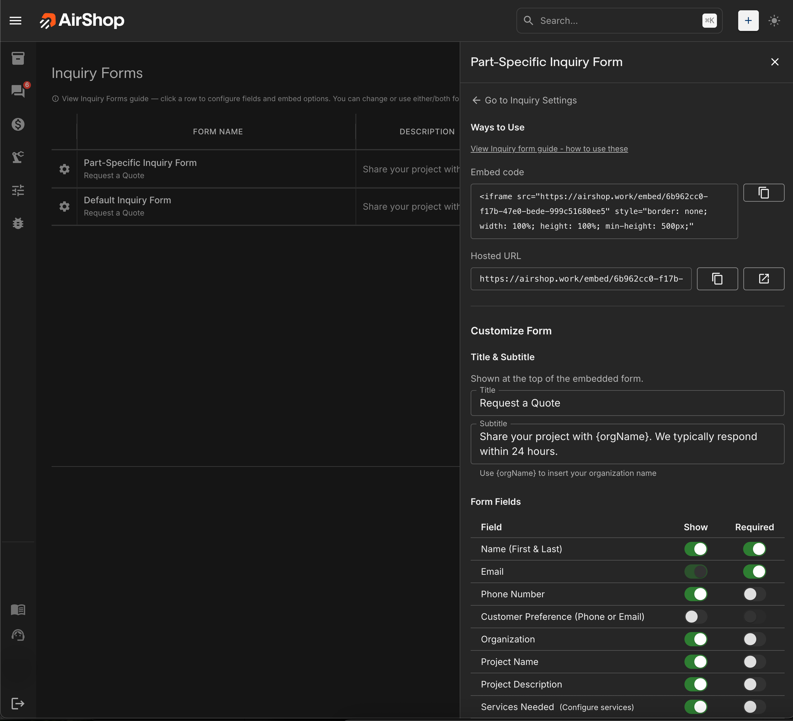

# Inquiry Forms

Your inquiry form collects project details from potential customers. You can share it in two ways: as a **Hosted URL** (a direct link) or as an **Embed** (form built into your website). This guide explains both options, form types, and how to configure your forms.

## Quick Start: Who Does What?

- **You (or your team):** Copy the Hosted URL or Embed code from the form drawer in AirShop.
- **Your website manager or developer:** Adds the embed code to your site, or you can share the Hosted URL for them to link to.
- **Your marketing or social team:** Uses the Hosted URL in Instagram bio, email signatures, text messages, and more.

If you don't manage your own site, send this guide and the relevant link or code to whoever does.

---

## Form Types

AirShop provides two inquiry form types:

| Form | Best For |
|------|----------|
| **Default Inquiry Form** | General quote requests. Collects contact info, project details, services, materials, budget, deadline, and file attachments. |
| **Part-Specific Inquiry Form** | Quote requests tied to specific parts. Same fields as Default, plus a **Part files** section where customers upload CAD or part files for each item. |

Both forms use the same [Inquiry Settings](inquiry-settings.md) for materials, services, and referral source options. You can use one or both forms.

{ .screenshot }

---

## Managing Forms

1. Go to **Forms** in the left nav (or **Settings** → **Forms**).
2. Click a form row to open the **form drawer**.
3. In the drawer you can:
   - Copy the **Hosted URL** or **Embed code**
   - Customize **Title** and **Subtitle**
   - Toggle **Form Fields** (show/hide, required)
   - Set the **Confirmation Message** shown after submission
   - Configure **Materials** and **Services** (links to [Inquiry Settings](inquiry-settings.md))

## Option 1: Hosted URL

The **Hosted URL** is a direct link to your form. Anyone who clicks it opens the form in their browser. No website changes needed.

### How It Works

- Copy the URL from the form drawer (e.g. `https://yoursite.com/embed/abc123`).
- Paste it anywhere you want people to access the form.
- When someone clicks, they see the form in a clean, mobile-friendly page.

### Best Uses for the Hosted URL

| Use Case | Why It Works |
|----------|--------------|
| **Instagram bio** | One link for "Link in bio." Customers tap and fill out the form on their phone. |
| **Text message** | Send the link in a text or WhatsApp. Great for follow-ups or when a customer asks for a quote. |
| **Email** | Add the link in your signature, newsletters, or quote follow-ups. Recipients click and submit. |
| **QR code** | Generate a QR code from the URL and put it on business cards, flyers, or at events. |
| **Social posts** | Share the link in Facebook, LinkedIn, or other platforms when you want to collect inquiries. |

### How to Add It

1. Open your form in AirShop and click the row to open the drawer.
2. At the top, under **Ways to Use**, find **Hosted URL**.
3. Click the copy button next to the URL.
4. Paste it wherever you want (Instagram, email, text, etc.).

## Option 2: Embed Code

The **Embed** lets you put the form directly on your website, like replacing a generic contact form with your custom inquiry form.

### How It Works

- You get a short snippet of code (an iframe) from AirShop.
- Your website manager (or you, if you edit your site's HTML) pastes that code into a page.
- The form appears on your site. Visitors fill it out without leaving your website.

### Best Use: Replace Your Contact Form

If your site has a basic "Contact us" form, the embed is a better option because:

- You collect **project details** (services, budget, deadline) instead of just name and email.
- Submissions go straight into AirShop as inquiries.
- The form matches your branding and fields you've configured.
- No need to send people to a separate page. They stay on your site.

### How to Add It to Your Website

1. Open your form in AirShop and click the row to open the drawer.
2. Under **Ways to Use**, find **Embed code**.
3. Click the copy button to copy the full embed code.
4. Send the code to your website manager or developer with these instructions:

   > **For your website manager:** Paste this embed code into the page where you want the form to appear (e.g. a "Request a Quote" or "Contact" page). The code is an iframe. Most website builders (WordPress, Wix, Squarespace, Webflow, etc.) have an "Embed" or "HTML" block where you can paste it. The form will display at the width of its container and is responsive on mobile.

5. If you use a platform like WordPress, Wix, or Squarespace, look for:
   - **Embed** block (WordPress)
   - **Embed** or **Code** element (Wix, Squarespace)
   - **Custom HTML** or **Code** block (Webflow, Shopify)

   Paste the code there and save. The form will appear on the page.

---

## Form Drawer Configuration

When you click a form row, the drawer lets you customize:

- **Title & Subtitle** — Shown at the top of the form. Use `{orgName}` in the subtitle to insert your organization name.
- **Form Fields** — Toggle each field **Show** (visible) and **Required**. Fields include Name, Email, Phone, Organization, Project Name, Services Needed, Materials, Budget, Deadline, How did you find us, and File Attachments. Materials and Services link to [Inquiry Settings](inquiry-settings.md) to configure dropdown options.
- **Prompt when submitting without files** — If enabled (Default form only), users who submit with no attachments see a reminder dialog.
- **Confirmation Message** — Title and message shown after successful submission.
- **Reset to default template** — Restore the form to its original field layout.

---

## Summary

| Option | Use When |
|--------|----------|
| **Hosted URL** | Sharing via Instagram bio, text, email, QR codes, or social posts. No website changes. |
| **Embed** | You want the form on your website instead of (or in addition to) a contact form. |

Both options use the same form and send submissions to the same place. You can use one or both. For example, embed on your site and also share the Hosted URL in your Instagram bio.

---

## Related

- [Inquiry Settings](inquiry-settings.md) — Materials, services, referral sources, notifications, and auto-reply
- [Setup FAQ](faq.md) — Common questions
