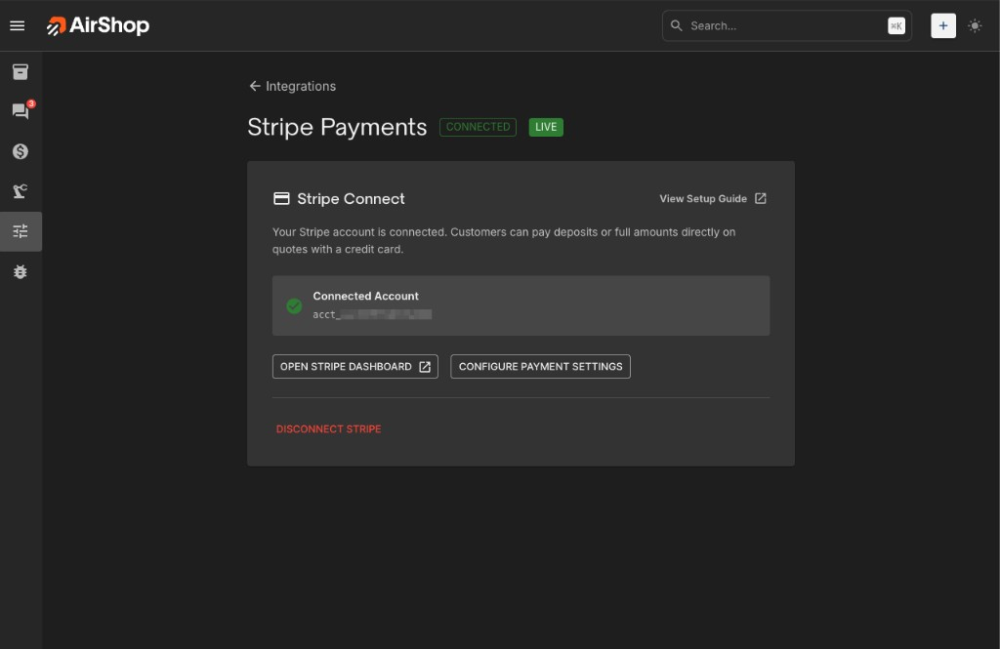
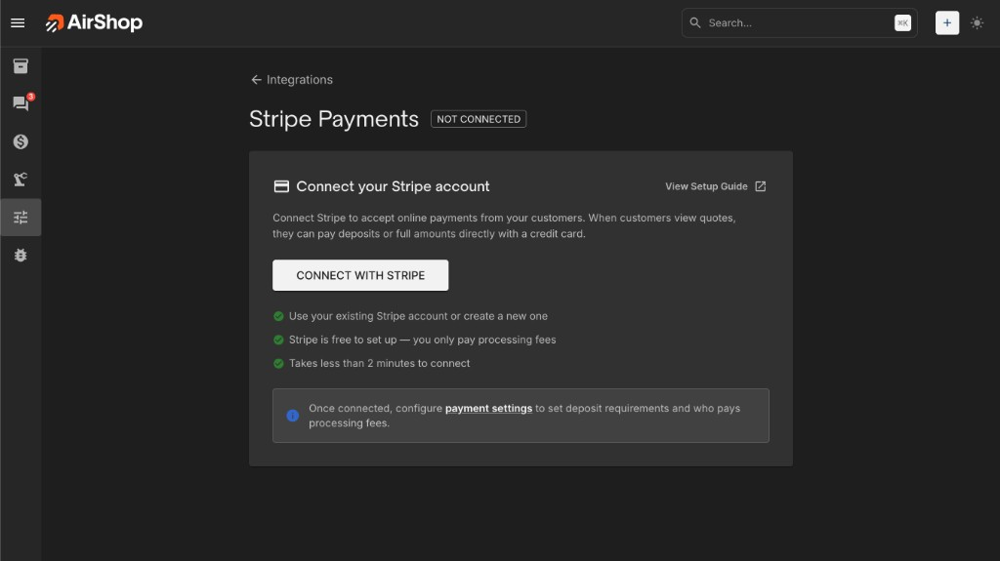
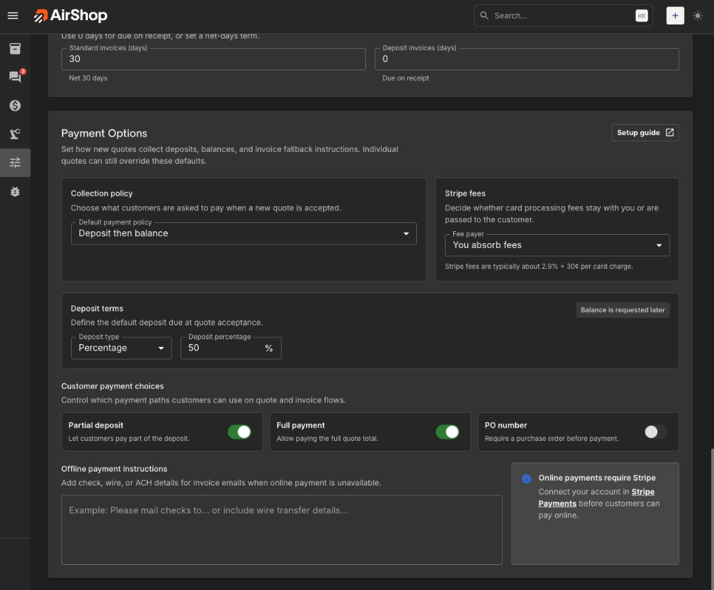
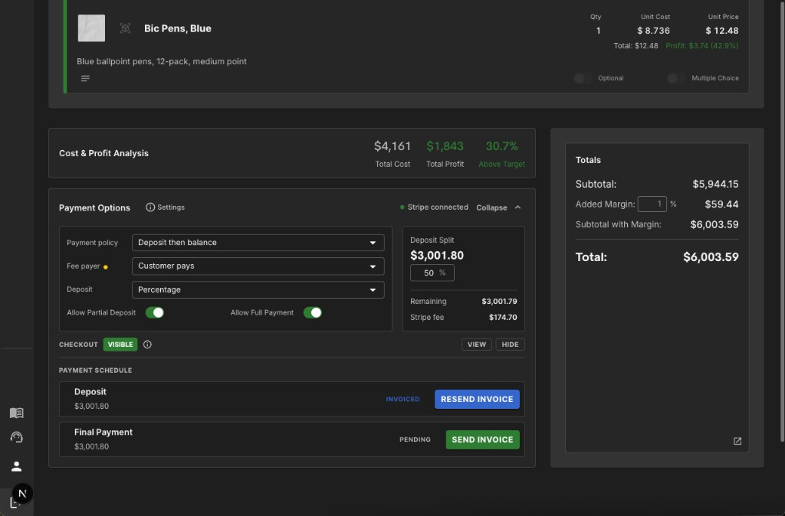
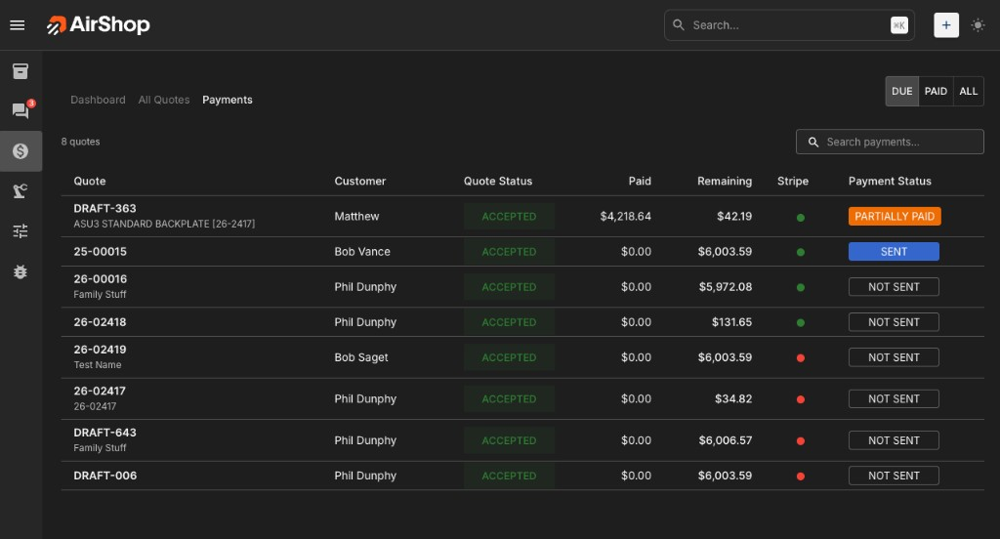
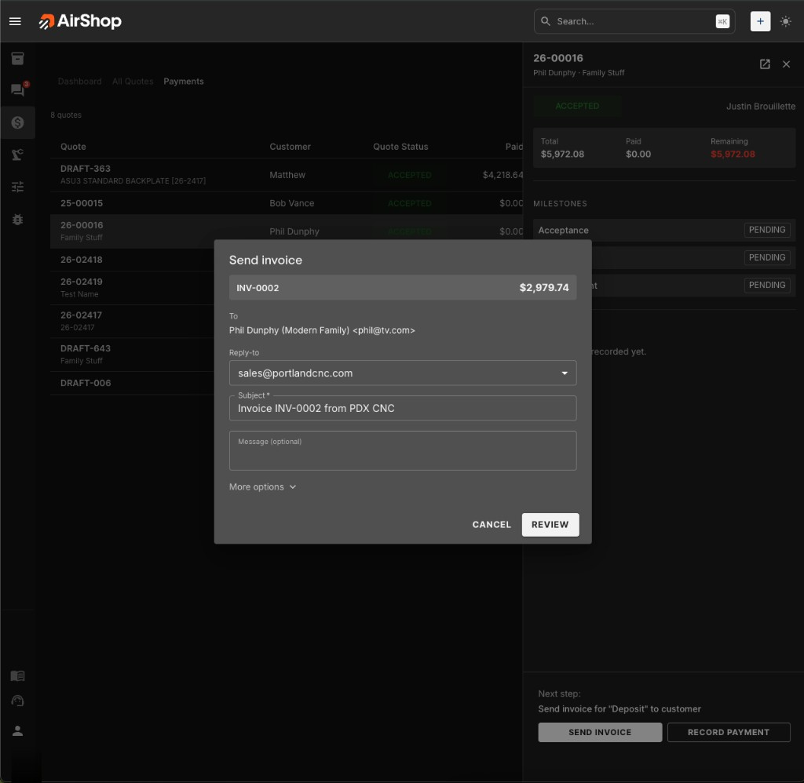
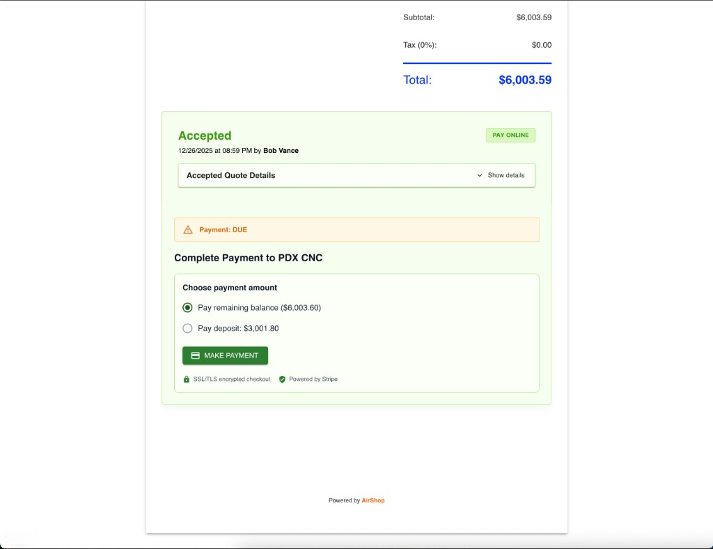

# Quotes & invoicing with Stripe Connect

Collect deposits and milestone payments **through your own Stripe account** using **[Stripe Connect](https://stripe.com/connect)**. AirShop never holds your customer’s payment information; card charges are processed on your connected Stripe account (separate from your [AirShop subscription](subscription.md) billing).

!!! tip "Where everything lives"

    - **[Stripe Payments](https://airshop.work/settings/integrations/stripe){ target="_blank" rel="noopener noreferrer" }** — Connect or disconnect Stripe (organization administrators only).
    - **[Quote Settings](https://airshop.work/settings/quote-settings){ target="_blank" rel="noopener noreferrer" }** — Organization defaults for **Invoicing** and **Payment Options**.
    - **Quote Builder** — Per-quote payment terms, milestones, invoices, and public quote payment visibility.
    - **[Payments](https://airshop.work/quotes/payments){ target="_blank" rel="noopener noreferrer" }** — Team workspace for balances, milestones, sending invoices, recording offline payments, and (for those offline entries) correcting mistakes with **Void**.

---

## Prerequisites

1. **[Stripe Payments](https://airshop.work/settings/integrations/stripe){ target="_blank" rel="noopener noreferrer" }** — A Stripe account you can link to AirShop through Connect onboarding.
2. **Organization Administrator** role — Only org admins can start Connect onboarding and disconnect Stripe.

---

## 1. Connect Stripe (Stripe Connect)

1. Open **[Settings → Integrations → Stripe Payments](https://airshop.work/settings/integrations/stripe){ target="_blank" rel="noopener noreferrer" }** (direct URL: `airshop.work/settings/integrations/stripe`).
2. Click **Connect with Stripe** and complete Stripe’s authorization flow in the browser (you can use an existing Stripe account or create one).

AirShop uses **Stripe Connect** with Stripe’s standard OAuth onboarding (`connect.stripe.com/oauth`). You do **not** paste secret keys into AirShop—only the linked Connect account ID is stored after you authorize. Payouts and card data stay in Stripe; day-to-day money movement is managed from the [Stripe Dashboard](https://dashboard.stripe.com){ target="_blank" rel="noopener noreferrer" }.

### Test vs live

When your AirShop environment uses **Stripe test mode**, the integration page shows a **Test payments** indicator: checkout follows the same path as live, but no real money moves (use [Stripe test cards](https://docs.stripe.com/testing){ target="_blank" rel="noopener noreferrer" }). In **live mode**, the page shows **Live** and customer charges are real.

Some deployments keep separate test and live Connect accounts; AirShop picks the account that matches the current platform mode.

{ .screenshot }

!!! note "Disconnected state"

    If Stripe is **not** connected, you can still build payment milestones and send invoice emails. Customers pay using your offline instructions until Stripe Connect is complete.

{ .screenshot }

---

## 2. Organization defaults — Quote Settings

Open **[Quote Settings](https://airshop.work/settings/quote-settings){ target="_blank" rel="noopener noreferrer" }**, or jump straight to **[Invoicing](https://airshop.work/settings/quote-settings?scroll=invoicing-options){ target="_blank" rel="noopener noreferrer" }** or **[Payment Options](https://airshop.work/settings/quote-settings?scroll=payment-options){ target="_blank" rel="noopener noreferrer" }** (`#invoicing-options`, `#payment-options`).

### Invoicing (`#invoicing-options`)

Controls **automatic invoice emails** (PDF attachment optional) when milestones become due:

- **Auto-send first milestone invoice when customer accepts**
- **Auto-send when due** (completion or scheduled date)
- **Attach PDF to invoice email**
- **Subject** and optional **intro** HTML (tokens such as `{{invoice_number}}`, `{{quote_number}}`, `{{org_name}}`, `{{milestone_name}}`).
- **Invoice numbering** — format (`{seq}`, `{year}`, `{yy}`, `{month}`, `{prefix}`), padding, prefix, **next sequence** value.
- **Default due dates** — net days for standard vs deposit invoices (`0` = due on receipt).

### Payment Options (`#payment-options`)

Defaults for **new quotes** (each quote can override in Quote Builder):

| Default payment terms | Meaning |
|------------------------|---------|
| **No payment due at acceptance** | Nothing is due when the customer accepts. You can invoice or collect payment later using your normal process. |
| **Full amount at acceptance** | One payment for the quoted total after acceptance. |
| **Deposit then balance** | Deposit milestone plus a balance milestone; configure **percentage** or **fixed amount** default. |
| **Customer chooses amount** | Flexible collection at acceptance within the bounds you allow. |

When terms expect online payment:

- **Stripe processing fees** — **You absorb fees** vs **Customer pays fees** (approximate card-network costs are surfaced in-product).
- **Allow Partial Deposit** — Customer may pay less than the full deposit when allowed.
- **Allow Full Payment** — Customer may pay the full quote online when allowed.
- **Require PO Number** — Optional enforcement on the checkout path.
- **Offline payment instructions** — Shown in invoice email when Stripe payment links are **not** used.

The page links back to Stripe setup if online payments need Connect. You can also open payment defaults from the Stripe integration page (**Configure Payment Settings**).

{ .screenshot }

---

## 3. Per-quote payment settings (Quote Builder, bottom)

In the Quote Builder, scroll to the **Payment** section (`#quote-payment-options` anchor in the UI). There you can:

- Choose the **payment terms** and deposit configuration for **this quote** (aligned with organization defaults unless you override).
- View the **milestones** AirShop will invoice or track (deposit, balance, or custom milestone names depending on terms).
- **Set payment terms** when the quote had no schedule yet.
- For sent quotes where the public payment link can be tuned independently from saving line items:

    - Public payment visibility shows **VISIBLE** or **HIDDEN** on the public quote.
    - Use **Show** / **Hide** so customers either see a Stripe-powered payment option on the shared link or payment stays internal/offline-only while milestones remain saved.

**Send Invoice** opens the milestone invoice workflow for the **next open** milestone once the quote is eligible (for example accepted or invoicing-ready statuses). You can **resend** from the Payments page drawer as well.

**Settings** beside organization-level copy links to **[Quote Settings → Payment Options](https://airshop.work/settings/quote-settings?scroll=payment-options){ target="_blank" rel="noopener noreferrer" }** (`#payment-options`) for admins adjusting defaults.

{ .screenshot }

---

## 4. Payments workspace (`/quotes/payments`)

Reach it from **[Quotes → Payments](https://airshop.work/quotes/payments){ target="_blank" rel="noopener noreferrer" }** in the sidebar.

Purpose:

- Filters: **Due**, **Paid**, **All**
- Search by quote number, title, or customer
- Rows show quote status, amounts **Paid** and **Remaining**, a **Stripe** status indicator, and billing state (**Sent**, **Partially paid**, **Paid in full**, **Not sent**, etc.)
- Clicking a quote opens the **detail drawer**: acceptance date, milestones (pending / invoiced / paid / waived), each **payment** recorded, and actions:
    - **Send invoice** / **Resend invoice** for the next milestone
    - **Record payment** for checks, wires, ACH, cash, etc. (includes optional link to a milestone and reference fields)
    - **Void** — Appears only for **manually recorded** (offline) payments that did not go through Stripe checkout. Voiding fixes typos or reverses an internal entry; milestone balances recalculate. **Card or Checkout payments** are not voided in AirShop—process a **refund** (or partial refund) in [Stripe](https://dashboard.stripe.com){ target="_blank" rel="noopener noreferrer" } so your ledger matches the processor.

{ .screenshot }

{ .screenshot }

**Deep link:** append `?quote=<quote_id>` so a specific quote opens selected after load (handy when pasting URLs from teammates).

---

## 5. What customers see

1. Receive the public quote link (same workflow as **[Send and Share Quotes](../quotes/send-and-share-quotes.md)**).
2. Accept the quote when they are ready (your process may require approval first).
3. If public payment is **VISIBLE** and Stripe Connect is configured, customers can pay deposits, balances, or flexible amounts from the quote using Stripe.
4. Customers may receive invoice emails according to Quote Settings (**Invoicing**), including PDF and payment link when Stripe is enabled.

{ .screenshot }

Internally AirShop tracks milestone states (**pending**, **invoiced**, **paid**, **waived**) so invoices and reminders stay coherent.

---

## 6. Subscription vs merchant payments

- **Stripe Connect here** pays **your shop** via your connected Stripe account for **customer** quote payments.
- Your **AirShop subscription** invoice is billed separately ([Subscription](subscription.md)). Those charges do **not** use this Connect onboarding.

---

## 7. Troubleshooting

### Connect flow fails or returns an error on the Stripe page

- Finish the flow in the same browser session; avoid blocking pop-ups if your browser opens Stripe in a new window.
- Confirm you are signed into AirShop as an **organization administrator**.
- Return to **[Stripe Payments](https://airshop.work/settings/integrations/stripe){ target="_blank" rel="noopener noreferrer" }** and try **Connect with Stripe** again. If a yellow alert shows a message from the redirect, read it and retry after fixing the issue Stripe described.

### “Only admins can connect Stripe”

- Ask an **Organization Administrator** to complete Connect or to grant you admin if appropriate.

### Connected but customers still do not see card payment

- In **Quote Settings → Payment Options**, confirm terms expect online collection and fees/PO rules are as intended.
- In the **Quote Builder** payment section, confirm **public payment** is **VISIBLE** for the shared link.
- For **test** environments, confirm you are using [test card numbers](https://docs.stripe.com/testing){ target="_blank" rel="noopener noreferrer" }, not a real card.

### Cannot void a payment in the drawer

- **Void** is only for offline-recorded payments. For Stripe Checkout or card charges, use **Refunds** in the Stripe Dashboard so the processor and AirShop stay aligned.

---

## 8. Security and operations

- Never paste **Stripe secret keys** or restricted API keys into AirShop; connection is OAuth-only for Connect.
- Restrict **Connect**, **Disconnect**, and subscription billing to trusted org admins.
- After disconnecting in AirShop, your Stripe account still exists—reconnect anytime with **Connect with Stripe**.

---

## Related

- [Quote Settings](../quote-settings.md)
- [Quote Options Panel](../quotes/quote-options-panel.md) — Display and branding overrides in the Quote Builder (not payment terms).
- [Send and Share Quotes](../quotes/send-and-share-quotes.md)
- [Outbound Webhooks](../integrations/outbound-webhooks.md) — Still available for quoting automation alongside billing
