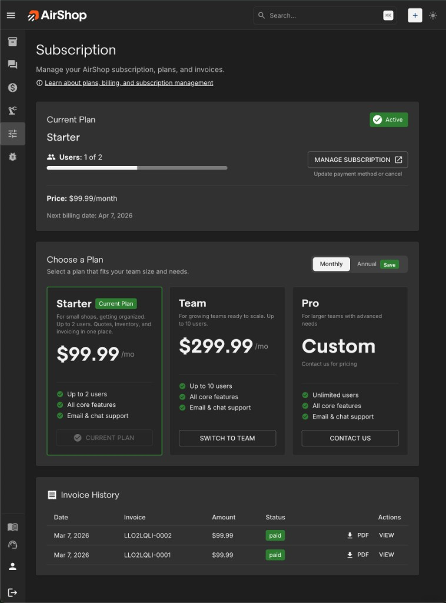
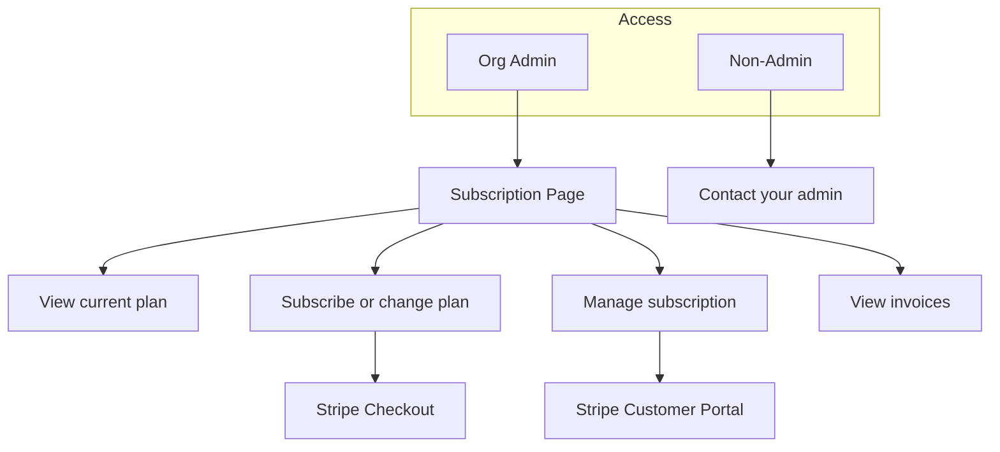

# Subscription

A paid subscription is required for all AirShop organizations. Organization administrators manage plans and payment at [airshop.work/subscription](https://airshop.work/subscription).

!!! note "Subscription vs. Billing"
    This page covers your **subscription** to AirShop (app access). 
    
    **Billing**—invoicing your customers for quotes is a coming soon [airshop.work/billing](https://airshop.work/billing)

---

## Plans & Pricing

AirShop offers three subscription tiers:

| Plan | User Limit | Best For |
|------|------------|----------|
| **Starter** | Up to 2 users | Freelancers and small shops |
| **Team** | Up to 10 users | Growing businesses |
| **Pro** | More than 10 users | Larger teams, unique needs |

Current plans and pricing are shown on the [Subscription page](https://airshop.work/subscription). You can choose monthly or annual billing for a discount.

Each team member must have their own user account. Sharing a single login across multiple people is not permitted. We monitor for misuse.

---

## How to Subscribe

1. Go to [Subscription](https://airshop.work/subscription) (or **Settings** → **Subscription**, or the Subscription link in the left nav).
2. Choose **monthly** or **annual** billing.
3. Select a plan (Starter, Team, or Pro).
4. Click **Subscribe** to open Stripe Checkout.
5. Enter your payment details and complete the checkout.

After payment succeeds, your organization is active and you can continue using AirShop.

---

## Managing Your Subscription

{ .screenshot }

Use **Manage subscription** on the [Subscription page](https://airshop.work/subscription) to open the Stripe Customer Portal. There you can:

- Update your payment method
- Change your plan (upgrade or downgrade)
- Switch between monthly and annual billing
- Cancel your subscription
- View and download invoices

_The payment portal opens in a new tab._

### Upgrade & Downgrade

| | When | What happens |
|---|-----|--------------|
| ↑ **Upgrade** (tier or monthly→annual) | Immediate | Prorated charge for rest of billing period |
| ↓ **Downgrade** (tier or annual→monthly) | End of period | Keep current plan until renewal |
| **User limit** | Before downgrade | Remove users first if over new plan's slots |

---

## Invoice History

Past invoices for your AirShop subscription appear on the Subscription page. You can also view and download invoices from the Stripe Customer Portal (via **Manage subscription**).

---

## Trial

New organizations receive a 14-day free trial with full Team features. During the trial:

- A **trial banner** in the nav shows how many days remain.
- When the trial is about to end, you'll see alerts prompting you to subscribe.

When the trial ends, you must subscribe to continue using AirShop. Go to [Subscription](https://airshop.work/subscription) to choose a plan and complete checkout.

---

## Who Can Manage Subscription

Only **Organization Administrators** can access the Subscription page and manage plans and payment. If you're not an admin, you'll see a message to contact your organization admin.

Admins can manage subscription from **Settings** or the Subscription link in the left nav.

---

## Payment Issues

**Past due** — If a payment fails, you have a grace period to update your payment method. Alerts will prompt you.

**Blocked access** — If payment isn't updated or your subscription is canceled, access may be blocked. The Subscription page stays accessible so you can update payment or reactivate.

**Reactivating** — Go to [Subscription](https://airshop.work/subscription) and update your payment method (if past due) or subscribe again (if canceled).

---

## Subscription Flow

---

## Related

- [Setup FAQ](faq.md)
- [Glossary](../glossary.md) — Subscription, Organization Administrator
